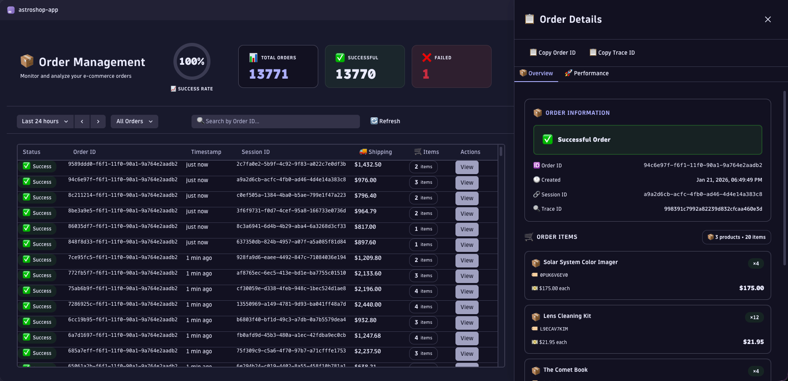
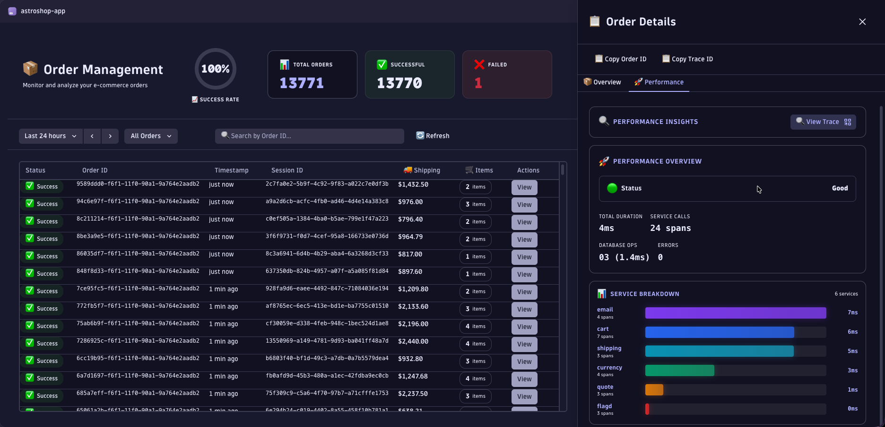

# AstroShop Demo App

> **Note:** This is a demo application for demonstration purposes only. It showcases how to build Dynatrace Apps using real observability data.

A Dynatrace App that provides business analytics and monitoring for the fictional AstroShop e-commerce platform. This app demonstrates how to query and visualize observability data from Dynatrace Grail using DQL (Dynatrace Query Language).

## Features

- **Order Analytics**: View order volume trends, revenue metrics, and conversion rates
- **Performance Monitoring**: Analyze checkout flow performance and identify bottlenecks
- **Business Events**: Query and visualize business events from Grail
- **Interactive Charts**: Time-series visualizations using Strato Design System components

## Screenshots

## Tech Stack

This project was bootstrapped with Dynatrace App Toolkit and uses React with TypeScript for a great developer experience.

## Available Scripts

In the project directory, you can run:

### `npm run start`

Runs the app in the development mode. A new browser window with your running app will be automatically opened.

Edit a component file in `ui` and save it. The page will reload when you make changes. You may also see any errors in the console.

### `npm run build`

Builds the app for production to the `dist` folder. It correctly bundles your app in production mode and optimizes the build for the best performance.

### `npm run deploy`

Builds the app and deploys it to the specified environment in `app.config.json`.

### `npm run uninstall

Uninstalls the app from the specified environment in `app.config.json`.

### `npm run generate:function`

Generates a new serverless function for your app in the `api` folder.

### `npm run update`

Updates @dynatrace-scoped packages to the latest version and applies automatic migrations.

### `npm run info`

Outputs the CLI and environment information.

### `npm run help`

Outputs help for the Dynatrace App Toolkit.

## Learn more

You can find more information on how to use all the features of the new Dynatrace Platform in [Dynatrace Developer](https://dt-url.net/developers).

To learn React, check out the [React documentation](https://reactjs.org/).
